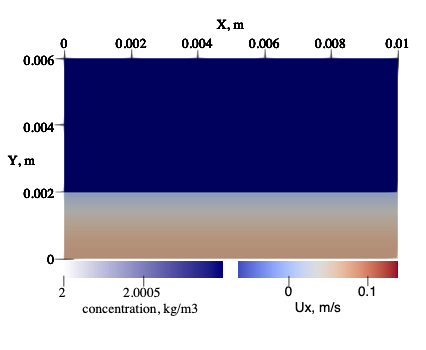
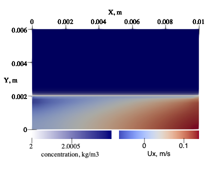
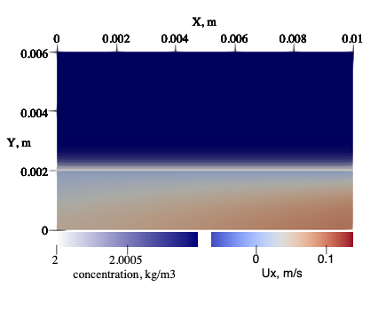
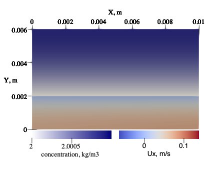
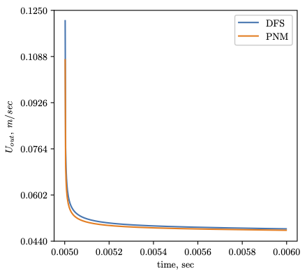

# Project Title
Validating the coupling of pore network and diffusion modelling 


## Motivation

The code is developed to validate the coupling of pore network and diffusion modelling 
which has been implemented in our research.

## Getting Started
```
git clone https://github.com/AleksZhuravlyov/dpnm_validation
cd dpnm_validation
mkdir build
cd build
cmake ..
cmake --build .
cd ..
python3 validation.py
```
### Prerequisites

The libraries you need to install and how to install them

#### macOS:
```
brew install eigen
brew install cmake
brew install vtk
brew install pybind
```
#### Ubuntu:
```
apt-get install eigen
apt-get install cmake
apt-get install vtk
apt-get install pybind
```

That is a bit more complicated to install OpenFoam which is required to run
the code. Please use the following links to get the instrtuctions on how to 
install and run OpenFoam

#### macOS:
https://github.com/mrklein/openfoam-os-x

#### Ubuntu:
https://www.openfoam.com/download/install-source.php

## Brief description
The developed code has the following key features:

- Navier-Stokes solver IcoFoam;
- Transient diffusion solver;
- Coupling of Navier-Stokes and numerical diffusion solvers;
- Simulating the diffusive and advective flows in the symmetric simplified model.

## Validation summary
To demonstrate the relevance of the proposed coupling method, a Navier-Stokes solver IcoFoam (OpenFoam)
was coupled with the above-mentioned transient diffusion solver which has been incorporated into the IcoFoam code. 
Such coupled solver is capable of simulating the diffusive and advective flows in the symmetric simplified model 
which has one cleat and two adjacent matrices. Due to the symmetry of this model, only one half of the cleat-matrix 
system was considered during simulation. The Navier-Stokes solver which is utilised for modelling the flow inside 
the cleat was run for a particular period (0.005 sec) with no diffusion. This was done to obtain the equilibrium profile
 of velocity and pressure distributions since the initial state of the model was not equilibrated.

Dirichlet and zero gradient boundary conditions were applied for inlet and outlet pressures and velocities in the Navier-Stokes
solver, correspondingly. For the coupling of the matrix-cleat interface of two-models, the velocity of fluid release from the
matrix was utilised as a velocity Dirichlet boundary condition for the Navier-Stokes solver. Likewise, a zero-gradient 
boundary condition for pressures was also applied for the matrix-cleat interface. All input parameters used for validation of 
two models are listed in Tables 1 and 2. Rather then describing some real simulation scenario, the chosen configuration of
 input parameters allows us to vividly represent the validation procedure under fast matrix depletion.
 
 Table 1. Physical parameters used for coupled model validation

| Parameter | Value |
| --------- | ----- |
| C<sub>cleat</sub> | 2 kg/m3 |
| C<sub>init</sub> | 2.001 kg/m3 |
| D | 5E-3 m2/sec |
| μ | 2E-2 Pa sec |
| P<sub>in</sub> | 300007 Pa |
| P<sub>out</sub> | Pa |
| ρ | 2 kg/m3 |

Table 2. Numerical input data used for coupled model validation.

| Parameter | Value |
| --- | --- |
|X, Z | 0.01, 0.01 m |
|Y<sub>matrix</sub>| 0.04 m |
|Y<sub>cleat</sub>| 0.04 m |
|matrix grid blocks| 100 (Y axis) |
|cleat grid blocks| 30 x 10 (X x Y axes) |
|time step| 2E-6 sec |

The assumption of fluid incompressibility allowed us to couple the diffusive and advective flows since
the concentration at the matrix layer nearest to the cleat being held constant. 
It might not be exactly appropriate to model the large system of cleats under the fluid incompressibility. 
However, such an assumption is relevant when the only one cleat is considered due to an insignificant pressure gradient along the flow path. 
Thus, this solver was used for validating our coupled PNM-diffusion model.

Different simulation time moments of the coupled Navier-Stokes-diffusion solver are illustrated in Figs. 1-4.
A state of the model before the commencement of gas release from the matrix is depicted in Fig. 1. 
There is a canonic velocity distribution for a plane Poiseuille flow and constant initial concentration inside the matrix. 
The following figure (see Fig. 2) represents the beginning of the gas flow from the matrix. 
The significant non-linear velocity gradient in both directions (X and Y) can be explained by numerical instabilities 
which have appeared due to the rapid change of the boundary conditions at the matrix-cleat interface. 
However, the observed increase of the fluid velocity along the flow path is mathematically correct and satisfies
implemented boundary conditions. 



Figure 1. Direct coupling of Navier-Stokes solver and transient diffusion model. Initial state. Velocities and concentration fields.



Figure 2. Direct coupling of Navier-Stokes solver and transient diffusion model. First time step. Velocities and concentration fields.
	
Figure 3 corresponds to the fifth time step where the velocity gradient has already slowed down while the matrix continued to deplete. 
The last Fig. 4 illustrates the two hundred and fiftieth time step which is characterised with a significant concentration decrease 
inside the matrix. This, in turn, leads to a much lower flow rate from the matrix to the cleat, where the velocity profile becomes
 similar to the one observed at the initial time before coupling.



Figure 3. Direct coupling of Navier-Stokes solver and transient diffusion model. Fifth time step. Velocities and concentration fields. 
 


Figure 4. Direct coupling of Navier-Stokes solver and transient diffusion model. Two hundred and fiftieth time step. 
Velocities and concentration fields.

The comparison of outlet velocities in PNM and Navier-Stokes solvers which are coupled with the numerical diffusion model is presented in Fig. 5. 
The outlet velocities are used when comparing two models since the velocity distributions have been depicted in Figs 1-4 above. 
These two curves closely match with the average relative error equals 1.21% while the local differences can be explained by the 
above-mentioned numerical instabilities when solving the Navier-Stokes equation.



Figure 5. Comparison of outlet velocities in pore-network and Navier-Stokes solvers coupled with diffusion. Average relative error between the values of two curves equals 1.21%.


## Authors

* [**Aleksandr Zhuravlyov**](https://github.com/AleksZhuravlyov/) and [**Zakhar Lanets**](https://github.com/lanetszb/)


## License

This project is licensed under the MIT License wich is a permissive free software license originating at the Massachusetts Institute of Technology (MIT) - see the [LICENSE](LICENSE) file for details

